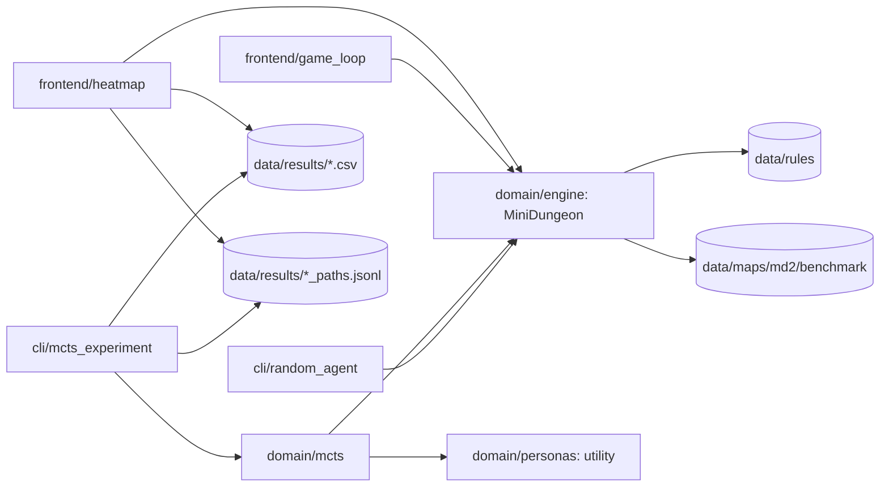

# MiniDungeons MCTS

Deterministyczna rekonstrukcja MiniDungeons 2 przygotowana jako środowisko do
testowania agentów i implementacji Monte Carlo Tree Search. Etap map i zasad
jest zamrożony; modułem badawczym jest MCTS.

## Jak program działa teraz

1. `MiniDungeon` czyta plik mapy oraz reguły z JSON i buduje stan początkowy.
2. `MiniDungeon.step()` wykonuje akcję bohatera, a potem deterministyczne tury NPC.
3. Stan udostępnia `legal_actions()`, `clone()`, `state_key()` i metryki gry.
4. `MonteCarloTreeSearch` buduje drzewo na klonach stanu, a liście ocenia
   funkcją użyteczności wybranej persony.
5. `cli/mcts_experiment` uruchamia próby w osobnych procesach i zapisuje CSV.



Agent MCTS tworzy `MiniDungeon` bezpośrednio ze ścieżki do pliku mapy — między
algorytmem a domeną nie ma warstwy serwisowej ani repozytorium.

### Granice warstw

| Warstwa | Odpowiedzialność | Nie zna |
| --- | --- | --- |
| `domain/engine` | stan, akcje, NPC, reguły, metryki | person, MCTS, wejścia-wyjścia |
| `domain/personas` | funkcje użyteczności czterech person | drzewa MCTS |
| `domain/mcts` | węzeł, UCB1, selekcja, ekspansja, rollout, propagacja | CSV, procesów, argumentów CLI |
| `infrastructure` | kanoniczne ścieżki, zapis i odczyt śladów partii | przebiegu tury |
| `cli` | argumenty, równoległość, zapis wyników | logiki potworów |
| `frontend` | rysowanie planszy, ręczna rozgrywka, heatmapy | reguł gry — akcje bierze z `legal_actions()` |

Zależności biegną do środka: `cli` woła `domain`, a `domain/mcts` woła
`domain/engine`. Silnik nie wie o istnieniu MCTS. Warstwa HTTP (FastAPI,
`GameService`, sesje REST) istniała we wcześniejszej wersji i została usunięta —
MCTS z niej nie korzystał. Jeśli powstanie wizualizacja, adapter należy dopisać
**obok** domeny, nie pod agentem.

## Szybki start

Projekt nie ma zewnętrznych zależności — wystarczy biblioteka standardowa.

Losowy agent jako punkt odniesienia:

```powershell
.\.venv\Scripts\python.exe -m src.minidungeons.cli.random_agent --map data\maps\md2\benchmark\map01.txt --trials 10 --quiet
```

Eksperyment MCTS-UCB1 według protokołu Tabeli II z artykułu:

```powershell
.\.venv\Scripts\python.exe -m src.minidungeons.cli.mcts_experiment --trials 50 --time-limit 300
```

Domyślnie liczy wszystkie 11 map i 4 persony, zapisując wyniki do
`data/results/ucb1_tree_terminal.csv`. Eksperyment jest **wznawialny**: po
przerwaniu przez Ctrl+C wystarczy uruchomić identyczną komendę, a policzone
próby zostaną pominięte. `--restart` nadpisuje plik od zera.

## Raport z policzonych wyników

Sama tabela z istniejącego CSV, bez uruchamiania choćby jednej próby:

```powershell
.\.venv\Scripts\python.exe -m src.minidungeons.cli.mcts_experiment --report-only
```

Inny plik wskazuje `--out`:

```powershell
.\.venv\Scripts\python.exe -m src.minidungeons.cli.mcts_experiment --report-only --out data\results\inny_eksperyment.csv
```

Drukuje układ z Tabeli II — Monsters, Potions, Treasures, Interactive Objects,
Win Rate oraz Time — jako średnia ± 95% przedział ufności dla R, MK, TC i C.

## Ręczna rozgrywka

```powershell
.\.venv\Scripts\python.exe -m src.minidungeons.frontend.game_loop --map data\maps\md2\benchmark\map04.txt
```

WSAD lub strzałki to ruch, klik w potwora z linią wzroku (albo Tab i Enter) to
rzut oszczepem, `R` restartuje partię. Wymaga `pygame-ce`
(`pip install -e .[gui]`).

## Heatmapa odwiedzin

Plansza rysowana dokładnie tak jak w ręcznej rozgrywce, z nałożoną **średnią
liczbą wizyt bohatera na kaflu w przeliczeniu na jedną partię**: im częściej
bohater bywał na kaflu, tym mocniejsza czerwień — od jasnego różu po ciemną
czerwień. Kafle nieodwiedzone zostają szare. Wymaga `pygame-ce`
(`pip install -e .[gui]`).

```powershell
.\.venv\Scripts\python.exe -m src.minidungeons.frontend.heatmap
```

Bez argumentów bierze wszystkie pliki z `data/results/`, które mają obok siebie
ślady partii (`ucb1_pe.csv` → `ucb1_pe_paths.jsonl`). Konkretny wybór na
start:

```powershell
.\.venv\Scripts\python.exe -m src.minidungeons.frontend.heatmap --results data\results\ucb1_pe.csv --map map04 --persona completionist --scale sqrt
```

Pod planszą jest pasek zakładek — po jednej na personę plus `SREDNIA` na
początku — a każda zakładka pokazuje **win rate tej persony na bieżącej mapie**,
więc rozbicie na persony widać bez przełączania. Aktywna zakładka jest obwiedziona
na żółto.

| Klawisz | Działanie |
| --- | --- |
| **Tab** | następna persona; cykl domyka się z powrotem na `SREDNIA`. To samo robi klik w zakładkę |
| ← → | mapa |
| `F` | przełączenie pliku wyników — tym porównuje się różne przebiegi |
| `W` | filtr: wszystkie partie / tylko wygrane / tylko przegrane |
| `L` | skala: liniowa / sqrt / log |
| `S` | zapis PNG do `data/results/heatmaps/` |

Dwie rzeczy o liczbach, bo przechodzą do pracy:

- średnia jest **na partię, nie na krok** — kafel odwiedzony dwa razy w jednej
  partii liczy się podwójnie, więc heatmapa pokazuje też zawracanie;
- widok zbiorczy to **średnia średnich** po personach, żeby persona z dłuższymi
  partiami nie przesłoniła pozostałych.

Skala jest **jednobarwna z monotonicznie malejącą jasnością** — to jasność, nie
odcień, koduje wielkość. Tęcza (granat → zieleń → czerwień) była pierwszą wersją
i była błędem: skoki odcienia sugerują kategorie, więc taką mapę czyta się tylko
z legendy. Kroki wzięte z profilu jasności skali sekwencyjnej przeniesionego na
czerwień; monotoniczności pilnuje test.

Filtr wygranych i win rate na zakładkach pochodzą z CSV — ślad nie zapisuje
wyniku partii. Win rate na zakładce jest zawsze z całego CSV, niezależnie od
ustawionego filtra, bo odpowiada na pytanie „która persona radzi sobie na tej
mapie", a nie opisuje aktualnie oglądanego podzbioru partii. Skala liniowa spłaszcza mapę, bo rozkład wizyt ma ciężki ogon; do
oglądania rzadko odwiedzanych rejonów jest `sqrt` i `log`.

## Użycie z Pythona

```python
from src.minidungeons.domain import MiniDungeon
from src.minidungeons.domain.mcts import MonteCarloTreeSearch

# samo środowisko
state = MiniDungeon("data/maps/md2/benchmark/map04.txt")
child = state.clone()
child.step(child.legal_actions()[0])

# agent MCTS na jednej mapie
agent = MonteCarloTreeSearch("data/maps/md2/benchmark/map04.txt")
metrics = agent.play_single_tree("runner", time_limit_s=30.0, seed=0)
```

## Dwie nazwy tego samego pakietu

Ten sam kod da się zaimportować dwiema drogami i **trzeba o tym wiedzieć**:

- `src.minidungeons...` — działa wprost z katalogu repozytorium, tak importują
  testy i tak wygląda uruchamianie przez `python -m src.minidungeons...`;
- `minidungeons...` — nazwa pakietu z `pyproject.toml`, dostępna po
  `pip install -e .`, używana przez skróty `minidungeons-random`,
  `minidungeons-mcts`, `minidungeons-play` i `minidungeons-heatmap`.

Python traktuje je jak **dwa osobne moduły** o niezależnym stanie. Dopóki
mieszają się w jednym procesie, jest to źródło trudnych do wyśledzenia błędów;
w pracy z repozytorium trzymaj się jednej drogi (`src.minidungeons`).

## Najważniejsze katalogi

```text
data/                         niezmienne wejścia eksperymentu
  maps/md2/benchmark/         11 map, manifest i pary portali
  maps/md2/source-images/     obrazy źródłowe i siatki kontrolne
  rules/                      parametry silnika i person (JSON)
  results/                    wyniki, ślady partii i heatmapy (poza gitem)
docs/
  rules/                      zasady gry i decyzje rekonstrukcyjne
  project/                    plan pracy inżynierskiej
  reference/articles/         publikacje źródłowe
  benchmark.md                walidacja i niepewności rekonstrukcji map
src/minidungeons/
  domain/                     silnik gry, persony, reguły i MCTS
  infrastructure/             kanoniczne ścieżki i ślady partii
  cli/                        programy konsolowe: agent losowy i eksperyment
  frontend/                   pygame, wymaga extras `gui`:
                                game_loop.py — ręczna rozgrywka
                                heatmap.py   — heatmapa odwiedzin z policzonych przebiegów
tests/                        testy według warstw
tools/                        walidator zamrożonego benchmarku
```

## Testy i walidacja

```powershell
.\.venv\Scripts\python.exe -m unittest discover -s tests -v
.\.venv\Scripts\python.exe tools\validate_stage0.py
```

## Dokumentacja

Cztery dokumenty, każdy odpowiada na jedno pytanie:

| Dokument | Odpowiada na pytanie |
| --- | --- |
| [Zasady gry](docs/rules/game-rules.md) | jak działa MiniDungeons 2, jakie są metryki i persony |
| [Decyzje rekonstrukcyjne](docs/rules/decisions.md) | co wzięliśmy z publikacji, a co rozstrzygnęliśmy sami i dlaczego |
| [Benchmark map](docs/benchmark.md) | skąd wzięło się 11 map, jak je zwalidowano i czego nie da się ustalić pewnie |
| [Plan pracy](docs/project/roadmap.md) | co jest zrobione, co zostało i w jakim terminie |

Publikacje źródłowe: `docs/reference/articles/`.
