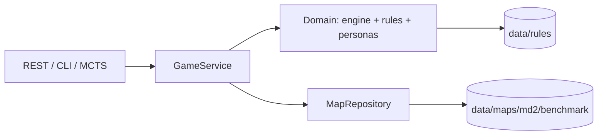

# MiniDungeons MCTS

Deterministyczna rekonstrukcja MiniDungeons 2 przygotowana jako backend do
testowania agentów i implementacji Monte Carlo Tree Search. Etap map i zasad
jest zamrożony; następnym modułem badawczym będzie MCTS.

## Jak program działa teraz

1. `MapRepository` czyta zamrożony manifest i wybiera mapę.
2. `GameService` tworzy środowisko lub zarządzaną sesję gry.
3. `MiniDungeon.step()` wykonuje akcję bohatera, a potem deterministyczne tury NPC.
4. Stan zwraca legalne akcje, metryki, użyteczności czterech person i planszę tekstową.
5. Ten sam serwis obsługują CLI, REST i przyszły worker MCTS.



Pełny opis znajduje się w [architekturze backendu](docs/architecture/backend.md).

## Szybki start

Rdzeń nie ma zewnętrznych zależności:

```powershell
.\.venv\Scripts\python.exe -m pip install -e .
minidungeons-random --map data/maps/md2/benchmark/map01.txt --trials 10 --quiet
```

Backend HTTP:

```powershell
.\.venv\Scripts\python.exe -m pip install -e ".[api]"
minidungeons-api
```

Z repozytorium, bez instalowania pakietu w trybie editable:

```powershell
.\.venv\Scripts\python.exe -m src.minidungeons.api.run
```

Po uruchomieniu dokumentacja OpenAPI jest dostępna pod
`http://127.0.0.1:8000/docs`.

## Użycie bez HTTP

```python
from minidungeons import GameService

service = GameService()
game = service.create_game("map04")
action = game["legal_actions"][0]
game = service.apply_action(
    game["session_id"],
    kind=action["kind"],
    direction=action["direction"],
    target_id=action["target_id"],
)

# Dla MCTS bez sesji i serializacji:
state = service.create_environment("map04")
child = state.clone()
child.step(child.legal_actions()[0])
```

## Najważniejsze katalogi

```text
data/                         niezmienne wejścia eksperymentu
  maps/md2/benchmark/         11 map, manifest i pary portali
  maps/md2/source-images/     obrazy źródłowe i siatki kontrolne
  rules/                      parametry silnika i person (JSON)
docs/                         architektura, zasady, benchmark, plan i publikacje
src/minidungeons/
  domain/                     czysta logika gry i person
  application/                przypadki użycia i sesje
  infrastructure/             repozytorium map i ścieżki danych
  api/                        opcjonalny adapter FastAPI
  cli/                        programy konsolowe
tests/                        testy według warstw
tools/                        walidatory danych
```

## Testy i walidacja

```powershell
.\.venv\Scripts\python.exe -m unittest discover -s tests -v
.\.venv\Scripts\python.exe tools\validate_stage0.py
```

## Dokumentacja

- [Architektura i backend](docs/architecture/backend.md) — przepływ programu,
  granice warstw, REST API i plan pod MCTS.
- [Zasady gry](docs/rules/game-rules.md) — pełna baza reguł MiniDungeons 2.
- [Decyzje implementacyjne](docs/rules/implementation-decisions.md) — skrót
  parametrów wykonywalnych dla człowieka.
- [Rozstrzygnięcia niejednoznaczności](docs/rules/ambiguity-resolutions.md) —
  decyzje tam, gdzie artykuły nie definiują zachowania.
- [Legenda symboli](docs/benchmark/legend.md),
  [liczebności obiektów](docs/benchmark/object_counts.md) i
  [rejestr niepewności](docs/benchmark/uncertainties.md) — dokumentacja
  rekonstrukcji map.
- [Plan pracy](docs/project/roadmap.md) — etapy pracy inżynierskiej.
- `docs/reference/articles/` — publikacje źródłowe.
