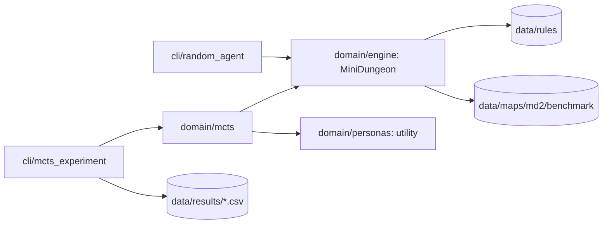

# MiniDungeons MCTS

Deterministyczna rekonstrukcja MiniDungeons 2 przygotowana jako środowisko do
testowania agentów i implementacji Monte Carlo Tree Search. Etap map i zasad
jest zamrożony; modułem badawczym jest MCTS.

## Jak program działa teraz

1. `MiniDungeon` czyta plik mapy oraz reguły z JSON i buduje stan początkowy.
2. `MiniDungeon.step()` wykonuje akcję bohatera, a potem deterministyczne tury NPC.
3. Stan udostępnia `legal_actions()`, `clone()`, `state_key()` i metryki gry.
4. `MonteCarloTreeSearch` buduje drzewo na klonach stanu, a liście ocenia
   funkcją użyteczności wybranej persony.
5. `cli/mcts_experiment` uruchamia próby w osobnych procesach i zapisuje CSV.



Agent MCTS tworzy `MiniDungeon` bezpośrednio ze ścieżki do pliku mapy — między
algorytmem a domeną nie ma warstwy serwisowej ani repozytorium.

Pełny opis znajduje się w [architekturze backendu](docs/architecture/backend.md).

## Szybki start

Projekt nie ma zewnętrznych zależności — wystarczy biblioteka standardowa.

Losowy agent jako punkt odniesienia:

```powershell
.\.venv\Scripts\python.exe -m src.minidungeons.cli.random_agent --map data\maps\md2\benchmark\map01.txt --trials 10 --quiet
```

Eksperyment MCTS-UCB1 według protokołu Tabeli II z artykułu:

```powershell
.\.venv\Scripts\python.exe -m src.minidungeons.cli.mcts_experiment --trials 50 --time-limit 300
```

Domyślnie liczy wszystkie 11 map i 4 persony, zapisując wyniki do
`data/results/ucb1_tree_terminal.csv`. Eksperyment jest **wznawialny**: po
przerwaniu przez Ctrl+C wystarczy uruchomić identyczną komendę, a policzone
próby zostaną pominięte. `--restart` nadpisuje plik od zera.

## Raport z policzonych wyników

Sama tabela z istniejącego CSV, bez uruchamiania choćby jednej próby:

```powershell
.\.venv\Scripts\python.exe -m src.minidungeons.cli.mcts_experiment --report-only
```

Inny plik wskazuje `--out`:

```powershell
.\.venv\Scripts\python.exe -m src.minidungeons.cli.mcts_experiment --report-only --out data\results\inny_eksperyment.csv
```

Drukuje układ z Tabeli II — Monsters, Potions, Treasures, Interactive Objects,
Win Rate oraz Time — jako średnia ± 95% przedział ufności dla R, MK, TC i C.

## Użycie z Pythona

```python
from src.minidungeons.domain import MiniDungeon
from src.minidungeons.domain.mcts import MonteCarloTreeSearch

# samo środowisko
state = MiniDungeon("data/maps/md2/benchmark/map04.txt")
child = state.clone()
child.step(child.legal_actions()[0])

# agent MCTS na jednej mapie
agent = MonteCarloTreeSearch("data/maps/md2/benchmark/map04.txt")
metrics = agent.play_single_tree("runner", time_limit_s=30.0, seed=0)
```

## Dwie nazwy tego samego pakietu

Ten sam kod da się zaimportować dwiema drogami i **trzeba o tym wiedzieć**:

- `src.minidungeons...` — działa wprost z katalogu repozytorium, tak importują
  testy i tak wygląda uruchamianie przez `python -m src.minidungeons...`;
- `minidungeons...` — nazwa pakietu z `pyproject.toml`, dostępna po
  `pip install -e .`, używana przez skróty `minidungeons-random`
  i `minidungeons-mcts`.

Python traktuje je jak **dwa osobne moduły** o niezależnym stanie. Dopóki
mieszają się w jednym procesie, jest to źródło trudnych do wyśledzenia błędów;
w pracy z repozytorium trzymaj się jednej drogi (`src.minidungeons`).

## Najważniejsze katalogi

```text
data/                         niezmienne wejścia eksperymentu
  maps/md2/benchmark/         11 map, manifest i pary portali
  maps/md2/source-images/     obrazy źródłowe i siatki kontrolne
  rules/                      parametry silnika i person (JSON)
  results/                    wyniki eksperymentów (poza gitem)
docs/                         architektura, zasady, benchmark, plan i publikacje
src/minidungeons/
  domain/                     silnik gry, persony, reguły i MCTS
  infrastructure/             kanoniczne ścieżki do danych
  cli/                        programy konsolowe: agent losowy i eksperyment
tests/                        testy według warstw
tools/                        walidator zamrożonego benchmarku
```

## Testy i walidacja

```powershell
.\.venv\Scripts\python.exe -m unittest discover -s tests -v
.\.venv\Scripts\python.exe tools\validate_stage0.py
```

## Dokumentacja

- [Architektura i backend](docs/architecture/backend.md) — przepływ programu,
  granice warstw i plan pod MCTS.
- [Zasady gry](docs/rules/game-rules.md) — pełna baza reguł MiniDungeons 2.
- [Decyzje implementacyjne](docs/rules/implementation-decisions.md) — skrót
  parametrów wykonywalnych dla człowieka.
- [Rozstrzygnięcia niejednoznaczności](docs/rules/ambiguity-resolutions.md) —
  decyzje tam, gdzie artykuły nie definiują zachowania.
- [Legenda symboli](docs/benchmark/legend.md),
  [liczebności obiektów](docs/benchmark/object_counts.md) i
  [rejestr niepewności](docs/benchmark/uncertainties.md) — dokumentacja
  rekonstrukcji map.
- [Plan pracy](docs/project/roadmap.md) — etapy pracy inżynierskiej.
- `docs/reference/articles/` — publikacje źródłowe.
