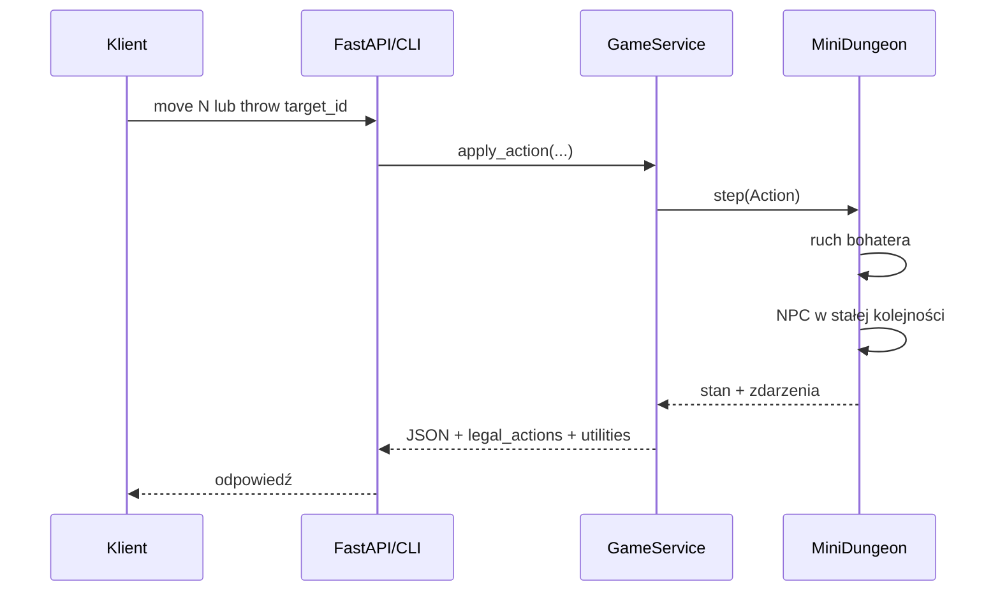

# Architektura backendu MiniDungeons MCTS

## Decyzja

Najlepszy backend dla tego projektu to **modularny monolit w Pythonie**:

- czysta domena bez frameworka;
- synchroniczny `GameService` jako publiczny przypadek użycia;
- FastAPI wyłącznie jako cienka warstwa HTTP;
- osobne procesy dopiero dla obliczeń MCTS, ponieważ są CPU-bound;
- pliki JSON/TXT jako wersjonowane, niezmienne wejście eksperymentu;
- SQLite na wyniki eksperymentów w następnym etapie, bez Redis/Celery na starcie.

Mikroserwisy nie przyniosłyby obecnie korzyści: gra, persony i MCTS muszą
dzielić jeden deterministyczny model stanu, a projekt jest lokalnym środowiskiem
badawczym, nie systemem obsługującym wielu użytkowników produkcyjnych.

## Granice warstw

| Warstwa | Odpowiedzialność | Nie powinna znać |
| --- | --- | --- |
| `domain` | stan, akcje, NPC, reguły, metryki, persony | HTTP, sesje, FastAPI |
| `application` | tworzenie gier, akcje, reset, serializacja kontraktu | szczegóły tras HTTP |
| `infrastructure` | manifest i bezpieczne ścieżki map | przebieg tury |
| `api` | statusy HTTP, walidacja żądań, OpenAPI | logika potworów |
| `cli` | uruchamianie lokalnych eksperymentów | implementacja HTTP |

Zależności biegną do środka: adaptery wywołują `GameService`, a serwis używa
domeny. `MiniDungeon` nigdy nie importuje FastAPI.

## Aktualny przebieg jednej akcji



`GameService.create_environment(map_id)` omija sesje i zwraca domenowe
środowisko. To jest właściwy interfejs dla MCTS: agent używa `clone()`,
`state_key()`, `legal_actions()` i `step()` bez kosztu HTTP ani serializacji.

## REST API v1

| Metoda | Endpoint | Znaczenie |
| --- | --- | --- |
| `GET` | `/health` | stan procesu i liczba aktywnych sesji |
| `GET` | `/api/v1/maps` | katalog map z wymiarami i liczebnościami |
| `GET` | `/api/v1/rules` | wykonywalny dokument zasad |
| `POST` | `/api/v1/games` | nowa sesja dla wybranej mapy |
| `GET` | `/api/v1/games/{id}` | pełny stan sesji |
| `POST` | `/api/v1/games/{id}/actions` | ruch lub rzut oszczepem |
| `POST` | `/api/v1/games/{id}/reset` | reset tej samej mapy |
| `DELETE` | `/api/v1/games/{id}` | usunięcie sesji z pamięci |

Przykładowe żądania:

```json
{"map_id": "map04"}
```

```json
{"kind": "move", "direction": "N"}
```

```json
{"kind": "throw", "target_id": 3}
```

Odpowiedź sesji zawiera `state`, `legal_actions`, `persona_utilities`, tekstową
`board` i — po akcji — `last_transition`.

## Następny moduł: zadania MCTS

Nie należy wykonywać długiego MCTS wewnątrz wątku żądania HTTP. Następny etap
powinien dodać:

1. `domain/mcts/` — węzeł, UCB1, selekcja, ekspansja, rollout i propagacja;
2. `application/experiments.py` — konfiguracja oraz uruchomienie jednej próby;
3. `ProcessPoolExecutor` — równoległe próby w osobnych procesach;
4. SQLite — konfiguracje, seed, wynik, czas i metryki, bez zapisywania całego drzewa;
5. endpointy `POST /api/v1/experiments` i `GET /api/v1/experiments/{id}`.

Najpierw wystarczy UCB1 i stały budżet iteracji. Redis, Celery, PostgreSQL oraz
kontenery można dodać dopiero wtedy, gdy eksperymenty będą uruchamiane na wielu
maszynach albo przez wielu użytkowników.

## Ograniczenia obecnej wersji

- sesje REST są w pamięci i znikają po restarcie procesu;
- backend powinien działać z jednym workerem, dopóki sesje nie trafią do
  współdzielonego magazynu;
- FastAPI jest opcjonalne; rdzeń działa wyłącznie na bibliotece standardowej;
- dane map i reguł są celowo tylko do odczytu podczas rozgrywki.
